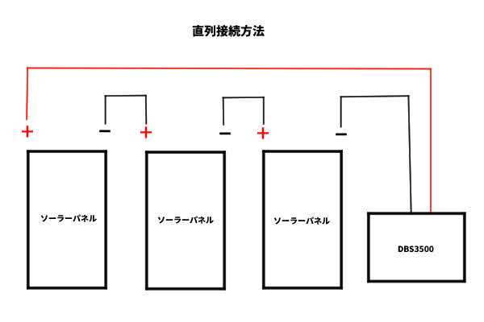

# 太陽光

## ソーラーパネル　

### 単結晶420Wロンジソーラー　LR5-54HPH-420M

枚数：3

---

## ポータブル電源

### Dabbsson DBS3500

個数：1

---

# 接続について

## 結論
✅ **420Wパネル3枚を「直列（3S）」で直結可能**  
❌ **3枚並列（3P）は不可**

---

## DBS3500 ソーラー入力仕様
- 入力電圧範囲：**DC 12–150V**
- 最大入力電流：**25A**
- 最大入力電力：**2400W**

---

## LR5-54HPH-420M（1枚あたり・STC）
- 開放電圧（Voc）：**37.75V**
- 短絡電流（Isc）：**14.01A**
- 動作電圧（Vmp）：**31.73V**
- 動作電流（Imp）：**13.24A**
- 定格出力：**420W**

---

## 接続パターン別チェック

### 🔹 3枚直列（3S）
- Voc合計：37.75 × 3 = **113.25V**（150V以下 → OK）
- 電流：**13.24A**（25A以下 → OK）
- 合計出力：420 × 3 = **1260W**（2400W以下 → OK）

✅ **安全に使用可能**

※ 冬季低温でVocは上昇しますが、3直列でも150Vには十分余裕あり。

---

### 🔹 3枚並列（3P）
- 電流：13.24 × 3 = **39.72A**

❌ **最大入力電流25Aを超えるため不可**

---

## 推奨接続方法
- **MC4コネクタで3枚を直列接続**
- 末端を **MC4 → XT60（DBS3500入力）** で接続
- 影の影響を受けやすいので、設置時は**影対策**に注意

---

## まとめ
| 接続方法 | 可否 | 理由 |
|---------|-----|------|
| 3直列（3S） | ✅ | 電圧・電流とも仕様内 |
| 3並列（3P） | ❌ | 電流オーバー |

