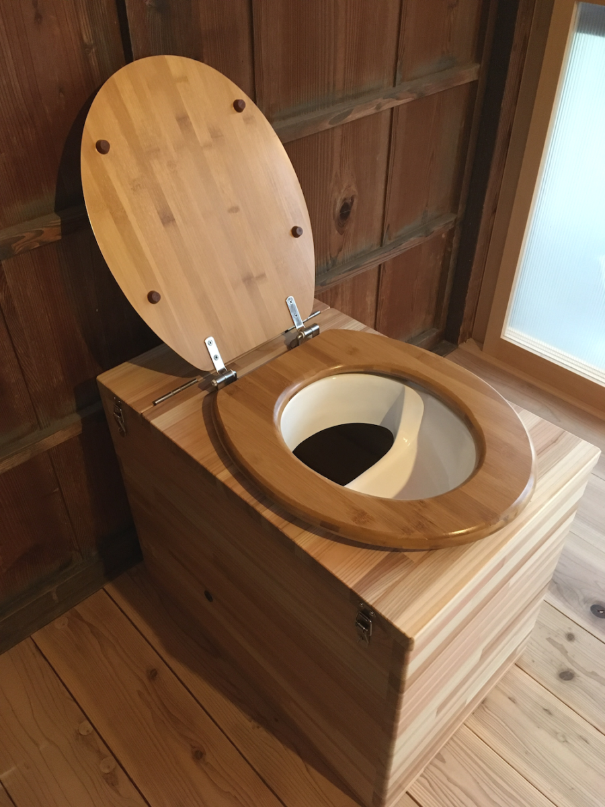
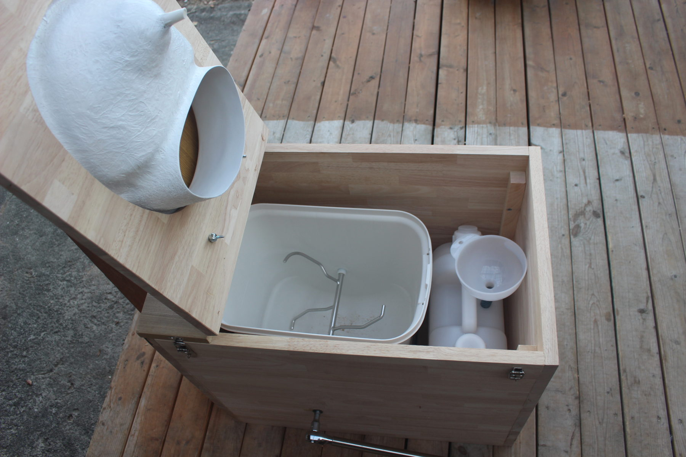
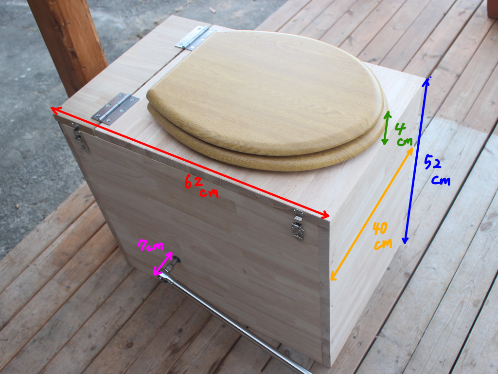
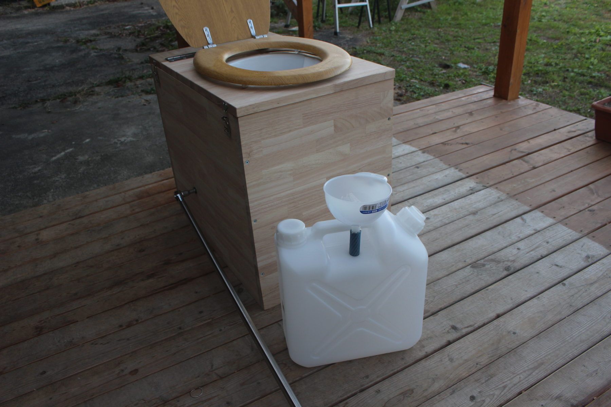
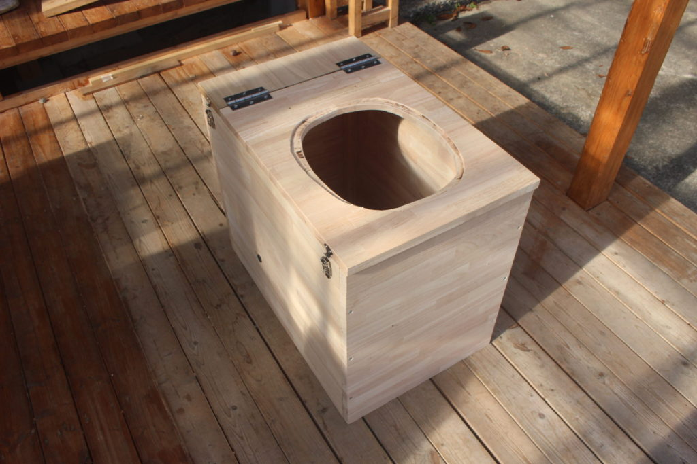
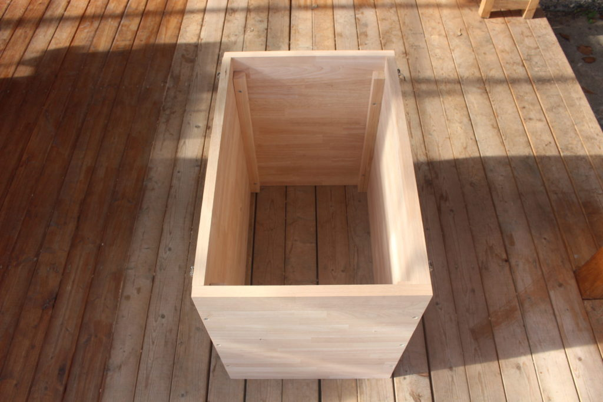

コンポストトイレ
🧪 分離式 × 乾式のシステム構造 ① 便は後方の堆肥チャンバーへ（固体）

木質素材（おがくず、籾殻など）を入れて水分を吸収

微生物が好気性で分解

排気パイプから空気を上向きに流す

年1回〜2回の取り出し

② 尿は前方スロットから別タンクへ（液体）

タンクで発酵 → 液肥に再利用可能 （水で5〜10倍希釈すれば果樹・森に最適）

タンクは満タンで運ぶだけなので軽い

③ 換気システム

自然通気でも可能

小型ファンを付けるとより理想的（1〜2W程度）

室内にニオイが戻らない構造が作れる

🌬 ニオイがほぼゼロになる理由

固体と尿を分離 → アンモニアの化学反応が起こらない

炭素材（おがくず）が水分を吸収 → 嫌気化しない

上方向への換気 → 室内に匂いが戻らない

微生物が分解 → 森の土の匂いに近づく

この方式は、適切に設計すれば「森林の腐葉土のような香り」になります。

