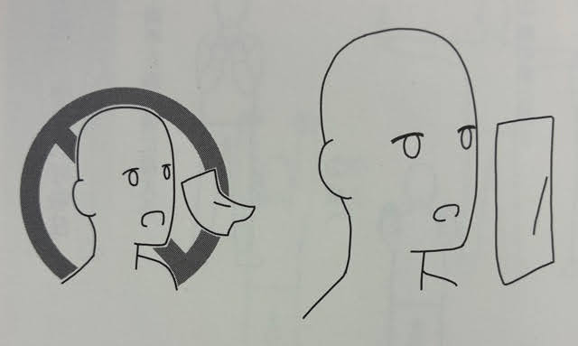

# 宇城式呼吸法

## 呼吸法  
### 口をぱっと開ける

宇城式呼吸法の基本は、  
まず口を軽くぱっと開けます。

口を開けた時は、  
息を吸うでもなく、吐くでもなく、  
ただぱっと口を開けるだけにします。

これだけで身体は  
口を開けない時よりも  
強くなります。

ペットボトルはフタを取ることによって中の水が自由に出入りできるようになりますが、
それは身体でも同じで、ただ口をぱっと開けることで、
身体の中に空気が出入りし、
身体が自然な状態となります。

- まずは口をパッと開けて気道を広げることを身体で理解する
  - 暇があれば口をパッと開けて気道を広げるイメージを繰り返してみる
  - 口を開けた結果、空気が自然と入る感じを目指す

動作の結果、自分の身体に起こる変化を感じることが大切

慣れれば口を開けたときの感覚を口を開けなくてもできるようになる

- １日暇なとき宇城式呼吸法を練習して口を開けたときに空気が自然と入る感じを得て次の日に畑の畝立ての続きを宇城式呼吸法をしながら鍬やスコップで畝立てしたら疲れないで腰も痛くならないで畝立てができた、宇城式呼吸法の凄さを実感。

## 宇城式呼吸法✖身体を使う作業　はとても相性がいい

# 呼吸の方向と確認方法

次に**鼻から息を吸い**、  
**手の動きに合わせて口でゆっくり吐いていきます。**

吐く時に重要なことは、  
**息を前方向に吐き出すのではなく、  
身体の中を通して下方へ落としこむように吐いていく**  
ということです。

---

## 呼吸が正しくできているかの確認方法

呼吸が正しくできているかどうかを見るには、  
**ティッシュペーパーを口の前に垂らし、  
そこで息を吐いてみると分かりやすい**です。

息を吐いた時に、  
**ティッシュペーパーが前にゆらいでしまう場合**は、  
呼吸の空気が**前に働いている状態**です。

これは**正しいあり方ではありません。**

---

## 正しい呼吸の状態

正しい呼吸とは、  
息を吐いても**ティッシュペーパーがゆらがない**、  
すなわち**息が体内を通って下へ落ちていく状態**です。

この方法で、  
**正しく呼吸できているかを確認してみてください。**

